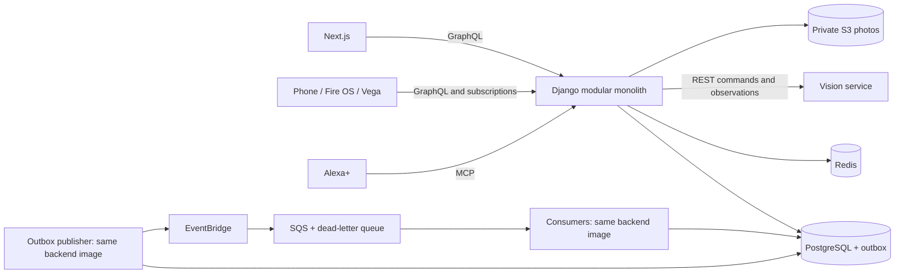

# Architecture v1: Modular Product and Independent Vision

## System Boundary

The product backend is one Django modular monolith: one codebase, one domain release, and one PostgreSQL database. Web/API processes, an outbox publisher, and background consumers may run as separate process roles from the same image. They are not separately owned business microservices. Next.js is the web presentation/BFF deployment. Vision is an independently deployed FastAPI microservice with a versioned REST interface and no direct access to product tables.



Raw media follows a separately authorized capture path; the diagram's REST link does not imply routing every video frame through GraphQL. Start integration with authorized recorded inputs, then benchmark live capture. Product-to-Vision control and result retrieval remain REST.

Dependencies point inward: interfaces -> application -> domain. Infrastructure implements application ports and is wired at the composition root. Domain modules do not import Django, Strawberry, boto3, Redis, FastAPI or ML libraries. Application services use repository, unit-of-work, clock, event-outbox and external-service ports. Small immutable domain values and entities are separate from Django ORM persistence models; mapping is explicit at adapters, without building a generic enterprise framework.

| Module | Owns |
|---|---|
| identity | Cognito mapping, authorization context, device grants |
| profiles | Preferences, availability, equipment and exclusions |
| goals | Goal revisions and measurement definitions |
| catalog | Exercises, supported analysis and routine templates |
| routines | Proposals, acceptance, immutable prescriptions |
| workouts | Session aggregate, state transitions, confirmed performance |
| progress | Historical projections and comparable goal measurements |
| media | Private photo metadata and upload/deletion lifecycle |
| coaching | Context assembly and constrained Bedrock proposals |
| integrations | Vision REST, Ring, Alexa+ adapters |

Each module exposes application use cases/DTOs. Do not import another module's ORM models to write its tables. Cross-module queries use explicit read services; optimized SQL projections are documented read-only adapters. Foreign keys within the shared database are acceptable. Critical invariants use direct application calls and one transaction where appropriate; EDA is not a reason to make every operation eventually consistent.

GraphQL resolvers and MCP tools contain transport adaptation and authorization checks, then invoke use cases. Next.js never writes the database. Django Admin invokes domain validation for edits with business invariants; it cannot bypass accepted-routine immutability.

```text
services/backend/
  src/kinetiq/
    modules/<module>/
      domain/          # entities, invariants, domain events
      application/     # use cases, DTOs, ports
      infrastructure/  # Django models/repositories, AWS adapters
      interfaces/      # GraphQL, MCP, consumers or HTTP adapters
    bootstrap/         # Django settings, ASGI routes, dependency wiring
    shared/            # IDs, clock, event envelope; no business dumping ground
  tests/{unit,integration,contract}/
```

## Event-Driven Architecture

Initial durable events: WorkoutSessionCompleted.v1, GoalChanged.v1, RoutineAccepted.v1, ProgressSummaryUpdated.v1 and ProgressPhotoDeleted.v1. Define payload allowlists, schema versions and producers/consumers in contracts/events. Do not emit raw landmarks, video, photo URLs, health details or provider tokens onto the shared bus. Events describe facts already committed; commands request changes.

The originating transaction writes business changes, its idempotency receipt and an outbox row together. An outbox publisher leases rows, publishes to EventBridge, checks individual publish results, then marks only successful entries delivered. A crash between publish and marking may duplicate delivery. Consumers use an inbox uniqueness key (consumer_name, event_id) and atomically store their database effect with the receipt before acknowledging SQS. No exactly-once guarantee is assumed.

Use SQS per independently retried consumer responsibility and a processing DLQ. Configure a separate EventBridge delivery DLQ for failures before reaching SQS. Set retry budgets, visibility timeouts and max receives explicitly; classify permanent validation errors, monitor oldest outbox/queue age and DLQ counts, and support deliberate replay. Events carry aggregate version, correlation and causation IDs. Since standard delivery can reorder events, projections check revision or recompute current state rather than blindly apply old increments. External effects require an idempotency token or reconciliation; a database inbox alone cannot make an external API call atomic.

Example: finishSession commits the session and outbox fact, returns committed state, and invalidates local cache after commit. Background handlers recompute progress and prepare a next-routine proposal. They never silently accept it. A failed progress rebuild does not undo the saved workout. An outbox consumer supplies durable cache invalidation/reconciliation if the immediate callback fails. Notifications remain subject to user preferences and validated channel capabilities.

Live pose updates use REST observation reads into the backend, then ephemeral GraphQL subscriptions. They do not pass through EventBridge/SQS. Redis is cache and transient fan-out, not a durable event log. Add no Kafka, Celery or event sourcing requirement at this stage; worker commands in the monolith are enough for the selected SQS adapter.

Sources: [AWS transactional outbox](https://docs.aws.amazon.com/en_en/prescriptive-guidance/latest/cloud-design-patterns/transactional-outbox.html), [EventBridge retries](https://docs.aws.amazon.com/eventbridge/latest/userguide/eb-rule-retry-policy.html).

## Scale and Reliability

Scale web/API replicas by measured request latency/concurrency; scale consumers by queue age/backlog; scale Vision by active analyses and inference latency. Configure connection budgets across PostgreSQL replicas/processes, bounded worker concurrency, timeouts and rate limits. Autoscaling alone does not fix unbounded queries or CPU work on ASGI loops.

Attach correlation IDs to GraphQL/MCP commands, REST requests, outbox messages and logs. Measure p95 API and observation latency, dropped/stale frames, target switches, queue lag, DB connection use and cache hit rate. Logs contain identifiers and reason codes, not footage or secrets. Define numeric SLOs after baseline measurement and before load acceptance.

Deploy immutable images via existing Terraform/GitHub Actions design. Expand/contract migrations preserve rollback compatibility. Validate backup restoration and DLQ replay before claiming operational readiness. Include worker, messaging and observability costs in the deployment estimate.

## Architecture Verification

Unit tests cover pure invariants. Integration tests use PostgreSQL and Redis for transaction/idempotency behavior. Contract tests verify GraphQL and REST schemas, schema evolution and event payloads. Add import-boundary checks once packages exist. Test duplicate/out-of-order messages, publisher crashes, Redis loss, Vision timeout/restart, expired credentials and cross-user access. Release gates include both application correctness and the Vision evaluation report.